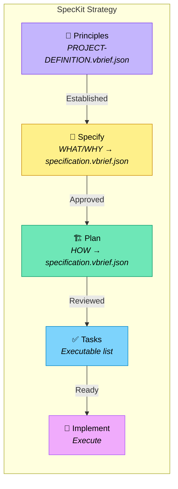

# SpecKit Strategy

A five-phase spec-driven development workflow inspired by [GitHub's spec-kit](https://github.com/github/spec-kit).

Legend (from RFC2119): !=MUST, ~=SHOULD, ≉=SHOULD NOT, ⊗=MUST NOT, ?=MAY.

**⚠️ See also**: [strategies/interview.md](./interview.md) | [strategies/discuss.md](./discuss.md) | [core/glossary.md](../core/glossary.md)

## When to Use

- ~ Large or complex projects with multiple contributors
- ~ Projects requiring formal specification review
- ~ When parallel agent development is planned
- ~ Enterprise environments with compliance requirements
- ? Skip Phase 1 if PROJECT-DEFINITION.vbrief.json Principles narrative already defined

## Workflow Overview



---

## Phase 1: Principles

**Goal:** Establish immutable project principles before any specification.

**Output:** `Principles` narrative in `vbrief/PROJECT-DEFINITION.vbrief.json`

### Process

- ! Define 3-5 non-negotiable principles
- ! Include at least one anti-principle (⊗)
- ! Write principles as the `Principles` narrative in `vbrief/PROJECT-DEFINITION.vbrief.json`
- ~ Interview stakeholders about architectural constraints
- ⊗ Proceed without defined principles
- ⊗ Create a standalone `project.md` -- principles belong in PROJECT-DEFINITION.vbrief.json

### Transition Criteria

- ! `Principles` narrative in `vbrief/PROJECT-DEFINITION.vbrief.json` is complete
- ! All stakeholders have reviewed principles
- ~ No `[NEEDS CLARIFICATION]` markers remain

---

## Phase 2: Specify (WHAT/WHY)

**Goal:** Document WHAT to build and WHY, without implementation details.

**Output:** WHAT/WHY narratives in `vbrief/specification.vbrief.json`

Write the following narrative keys to `vbrief/specification.vbrief.json` `plan.narratives`:

- `ProblemStatement` -- what problem this solves
- `Goals` -- desired outcomes
- `UserStories` -- user scenarios with priorities (P1, P2, P3) and acceptance scenarios (Given/When/Then)
- `Requirements` -- numbered functional (FR-001) and non-functional (NFR-001) requirements
- `SuccessMetrics` -- measurable success criteria (SC-001)
- `EdgeCases` -- boundary conditions and error handling

### Guidelines

- ! Focus on WHAT users need and WHY
- ! Use `[NEEDS CLARIFICATION: question]` for any ambiguity
- ! Number all requirements (FR-001, NFR-001) for traceability
- ! Prioritize user stories (P1, P2, P3)
- ⊗ Include HOW to implement (no tech stack, APIs, code)
- ⊗ Guess when uncertain -- mark it instead
- ⊗ Create `specs/` directories or standalone `spec.md` files -- all content goes in `vbrief/specification.vbrief.json`

### Transition Criteria

- ! No `[NEEDS CLARIFICATION]` markers remain in narratives
- ! All user stories have acceptance scenarios
- ! Requirements are testable and unambiguous
- ! Stakeholders have approved specification narratives

---

## Phase 3: Plan (HOW)

**Goal:** Document HOW to build it with technical decisions.

**Input:** Approved WHAT/WHY narratives in `vbrief/specification.vbrief.json`

**Output:** HOW narratives enriching `vbrief/specification.vbrief.json`

Add the following narrative keys to `vbrief/specification.vbrief.json` `plan.narratives`:

- `Architecture` -- high-level system design (components, data model, API contracts)
- `TechDecisions` -- technology choices with rationale
- `ImplementationPhases` -- phased delivery plan with dependencies
- `PreImplementationGates` -- simplicity gate, test-first gate

### Guidelines

- ! Reference spec requirements (FR-001, etc.) from Phase 2 narratives
- ! Document rationale for every technology choice
- ! Pass all pre-implementation gates before proceeding
- ⊗ Write implementation code
- ⊗ Create `specs/` directories or standalone `plan.md` files -- all content goes in `vbrief/specification.vbrief.json`

### Post-Phase 3: Render for Review

- ! Run `task spec:render` to produce `SPECIFICATION.md` as a read-only rendered export
- ! `SPECIFICATION.md` is for human review only -- `vbrief/specification.vbrief.json` remains the source of truth

### Transition Criteria

- ! All gates pass (or exceptions documented)
- ! Every spec requirement maps to a plan element
- ! Architecture reviewed and approved

---

## Phase 4: Tasks

**Goal:** Generate an executable task list from the plan.

**Input:** Approved `plan.md` + supporting documents

**Output:** `./vbrief/plan.vbrief.json` — the live task tracker for this feature

### Task Structure

Write tasks to `./vbrief/plan.vbrief.json` using vBRIEF v0.5 format:

```json
{
  "vBRIEFInfo": { "version": "0.5" },
  "plan": {
    "title": "[Feature name]",
    "status": "running",
    "items": [
      {
        "id": "t1.1",
        "title": "Initialize project structure",
        "status": "pending",
        "narrative": { "Acceptance": "[criteria from spec]" }
      },
      {
        "id": "t2.1",
        "title": "Define API contracts",
        "status": "pending"
      },
      {
        "id": "t3.1",
        "title": "Implement data layer",
        "status": "pending"
      }
    ],
    "edges": [
      { "from": "t2.1", "to": "t3.3", "type": "blocks" },
      { "from": "t3.1", "to": "t3.2", "type": "blocks" }
    ]
  }
}
```

**Parallelism:** Tasks with no `blocks` edges incoming are parallelizable. Use `blocks` edges instead of the old `[P]`/`[S]`/`[B]` markers.

### Guidelines

- ! Derive tasks from plan phases and deliverables
- ! Use vBRIEF `blocks` edges to express dependencies (replaces `[P]`/`[S]`/`[B]` markers)
- ! Put acceptance criteria in the task `narrative` field
- ~ Size tasks for 1-4 hours of work
- ~ Assign `agent` field for swarm mode
- ⊗ Create tasks not traceable to plan

### Transition Criteria

- ! All plan deliverables have corresponding tasks in `./vbrief/plan.vbrief.json`
- ! Dependencies form a valid DAG (no cycles in `blocks` edges)
- ! All tasks have `narrative` with acceptance criteria

---

## Phase 5: Implement

**Goal:** Execute tasks following test-first discipline.

**Input:** `./vbrief/plan.vbrief.json` with all tasks at `pending` status

### Process

- ! Write tests BEFORE implementation (Red)
- ! Implement minimal code to pass tests (Green)
- ! Refactor while keeping tests green (Refactor)
- ! Update task status in `./vbrief/plan.vbrief.json` as work progresses (`pending` → `running` → `completed`)
- ~ Work on tasks with no incoming `blocks` edges in parallel when possible

### File Creation Order

1. Create contract/API specifications
2. Create test files (contract → integration → unit)
3. Create source files to make tests pass
4. Refactor and document

### Guidelines

- ! Follow project.md Principles throughout
- ! Update `./vbrief/plan.vbrief.json` task statuses as work progresses
- ⊗ Implement without failing tests first
- ⊗ Skip refactoring phase

---

## Artifacts Summary

| Phase | Artifact | Purpose |
|-------|----------|---------|
| 1. Principles | `vbrief/PROJECT-DEFINITION.vbrief.json` | Governing rules (Principles narrative) |
| 2. Specify | `vbrief/specification.vbrief.json` | WHAT/WHY narratives |
| 3. Plan | `vbrief/specification.vbrief.json` | HOW narratives (enriches Phase 2) |
| 3b. Render | `SPECIFICATION.md` (rendered via `task spec:render`) | Read-only human review export |
| 4. Tasks | `./vbrief/plan.vbrief.json` | Live task tracker |
| 5. Implement | Code + tests | Working software |

## Directory Structure

```
project/
├── vbrief/
│   ├── PROJECT-DEFINITION.vbrief.json  # Phase 1: Principles narrative
│   ├── specification.vbrief.json       # Phase 2+3: WHAT/WHY + HOW narratives
│   └── plan.vbrief.json                # Phase 4: live task tracker
├── SPECIFICATION.md                    # Rendered export (task spec:render)
└── src/                                # Phase 5
```

## Invoking This Strategy

Set in PROJECT-DEFINITION.vbrief.json narratives:
```json
"Strategy": "strategies/speckit.md"
```

Or explicitly:
```
Use the speckit strategy for this project.
```

Start with:
```
I want to build [project] with features:
1. [feature]
2. [feature]
```
